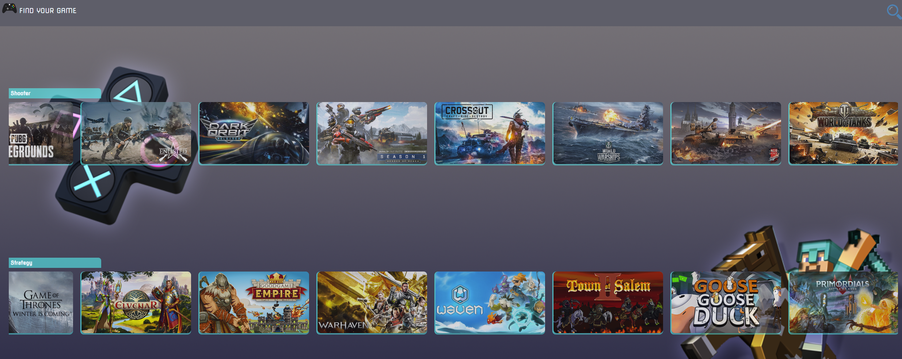

# Game Finder Online: Discover Your Gaming Paradise!

Welcome to Game Finder Online, your ultimate solution for uncovering the gaming gems that match your preferences! Whether you're a seasoned gamer or just getting started, Game Finder Online is here to make your quest for the perfect game an enjoyable experience.



## Overview

Game Finder Online takes your gaming experience to the next level by simplifying the process of discovering new games. No more endless scrolling through various platforms – we've got you covered. Unleash the gamer in you with our personalized game recommendations.

## HOW TO USE:
To use Game Finder Online, follow these steps:

1. **Clone the Repository:**
   ```bash
   git clone https://github.com/soufiane-oumalek/find_your_game.git
   ```
2. **Navigate to the projet directory:**
   ```bash
        cd find_your_game
   ```
3. **Install Dependencies:**
   ```bash
        pip install requests, flask
   ```
4. **Run the App:**
   ```bash
        python3 route.py
   ```

5. **Explore and enjoy the experience:**


## Authors:

This is a team project for ALX software engineering program by:

- **YOUSSEF ABOUYAHIA** - [Josh-techie](https://github.com/Josh-techie)
- **SOUFIANE OUMALEK** - [Soufiane-oumalek](https://github.com/soufiane-oumalek)


